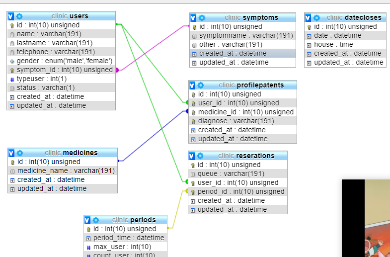

# Clinic-Application Programming Interface
> Use for Clinical Project only . 


## Update 
> ดู document api ได้ที่หน้า index


[![NPM Version][npm-image]][npm-url]
[![Build Status][travis-image]][travis-url]
[![Downloads Stats][npm-downloads]][npm-url]

##  RELATIONSHIP




## Usage example

- table symptoms  ไว้เก็บอาการป่วยต่างๆ 
- table profilepatent     profile ของ user ที่ป่วย
- table period ช่วงเวลาที่หมอรับคนเข้าคิว
- table reserration การจองของ user

## install 
```
npm install 
npm sequelize db:seed:all
```
## How to get API 
> ใช้ route resource รูปแบบมีดังนี้  
 ```javascript
var userServices = require('../service/UserServices');
app.resource('user', userServices);
```

 ```javascript
// GET     /forums              ->  index    หน้า list
// GET     /forums/new          ->  new      show form html ให้กรอกข้อมูล
// POST    /forums              ->  create   รับจาก form แบบ post
// GET     /forums/:forum       ->  show     แสดงข้อมูลที่ ละ 1
// GET     /forums/:forum/edit  ->  edit     show form edit
// PUT     /forums/:forum       ->  update   update data
// DELETE  /forums/:forum       ->  destroy
exports.index = function(req, res){
      res.send('forum index');
    };

    exports.new = function(req, res){
      res.send('new forum');
    };

    exports.create = function(req, res){
      res.send('create forum');
    };

    exports.show = function(req, res){
      res.send('show forum ' + req.params.user);
    };

    exports.edit = function(req, res){
      res.send('edit forum ' + req.params.user);
    };

    exports.update = function(req, res){
      res.send('update forum ' + req.params.user);
    };

    exports.destroy = function(req, res){
      res.send('destroy forum ' + req.params.user);
    };
```
>  req.params.  ตั้งชื่อ route ว่ายังไง  req.params. ก็จะชื่อตาม route ตอนส่ง Id 
example   route ชื่อ  facebook  จะเป็น req.param.facebook

### example URL
```
http://localhost:3000/user
http://localhost:3000/user/1
http://localhost:3000/user/1/edit

```
 > config scripts   "test": "nodemon ./bin/www"

 ```javascript
app.use(cors())
app.use(bodyParser.json());
app.use(bodyParser.urlencoded({
    extended: true
}));
```
<!-- Markdown link & img dfn's -->
[npm-image]: https://img.shields.io/npm/v/datadog-metrics.svg?style=flat-square
[npm-url]: https://npmjs.org/package/datadog-metrics
[npm-downloads]: https://img.shields.io/npm/dm/datadog-metrics.svg?style=flat-square
[travis-image]: https://img.shields.io/travis/dbader/node-datadog-metrics/master.svg?style=flat-square
[travis-url]: https://travis-ci.org/dbader/node-datadog-metrics
[wiki]: https://github.com/yourname/yourproject/wiki
